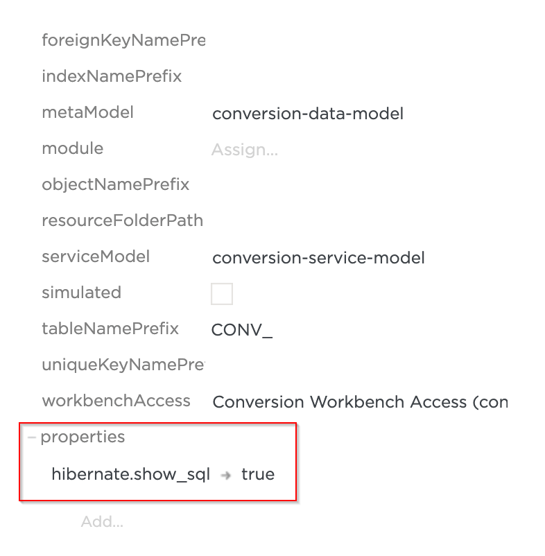

# Displaying Hibernate Access SQL Statements in Console
Hibernate has build-in a function to enable the logging of all the generated SQL statements to the console. You can enable it in Tribefire by adding a `hibernate.show_sql` property key to your hibernate access and setting it to `true`. Two related properties, `hibernate.format_sql` and `hibernate.use_sql_comments` are supported as well.

Property (key) | Description | Value
--- | --- | ---
`hibernate.show_sql` | Enables the logging of all the generated SQL statements to the console. | true/false
`hibernate.format_sql` | Formats the generated SQL statement to make it more readable, but also takes up more screen space. | true/false
`hibernate.use_sql_comments` | Hibernate will put comments inside all generated SQL statements to hint what’s the generated SQL trying to do. | true/false

To assign the above to your model, do the following:

1. Find your hibernate access in Control Center.
2. Click Add under properties. You will be first prompted for the key and then for the value.
3. Enter one of the properties (e.g `hibernate.show_sql`) as the key.
4. Enter `true` as the value. You should get the below result:

5. Commit your changes and redeploy the access. You should now see SQL statements in the access log output.