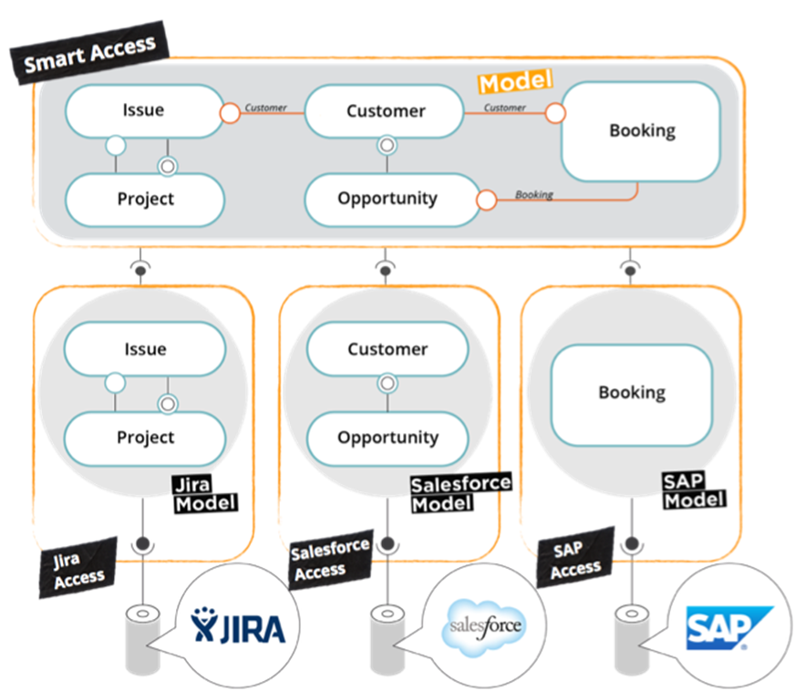

# Smart Access
>Smart access controls from which integration accesses is the data read from and written to.

## General
The smart access is a specific type of `IncrementalAccess` used as a delegating layer, controlling the logic of mapped data between its defined smart model and accesses from where the data required by smart model elements is stored. Once deployed, the integration is abstracted and allows data consumers to access the smart model as an API (either Java or REST), following tribefire's **model-as-API** paradigm.

## Smart Mapper
The smart access works in tandem with the smart mapper, a tool accessible from Control Center. The mapper provides the logic and the access carries out the actual functionality. This provides a level of data abstraction, since once the smart access is deployed, developers need only using one of the APIs (Java or REST) to reference the smart model, rather than trying to access the data directly.

During development, the smart access can also function in simulation mode, so that no real data needs to be integrated during development.
