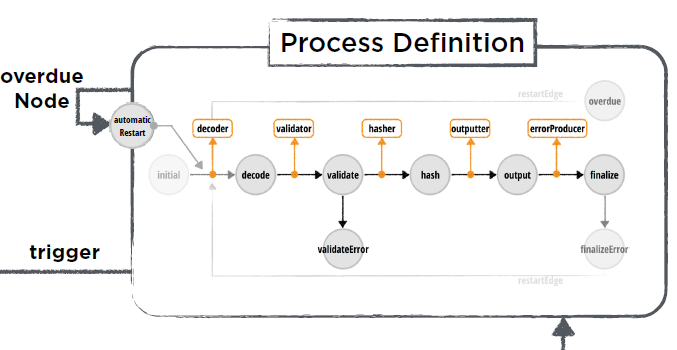

# Dataflow Engine Components
>There are several different connected components that make up the configuration and execution of a process.

## General
The components of the dataflow engine are as follows:
* [Business Model](dataflow_engine_components.md#business-model)
* [Process Definition](dataflow_engine_components.md#process-definiton)
* [Access](dataflow_engine_components.md#access)
* [State Processing Aspect](dataflow_engine_components.md#state-processing-aspect)
* [Processing Engine](dataflow_engine_components.md#processing-engine)

You must configure each part separately and connect them together for a process to work. The process itself can be considered as made up of two parts:

* First there is the process-derived entity that is contained in your business model. This entity contains all the required properties for the execution of a process, including a defined property that records the current state of this process. This is regarded as the trigger property.
* The other part of the process is the process definition, which defines the structure of the process. By using nodes and edges, the process definition defines the flow of the process and the changes/operations that should be carried out by the state engine on the Process-derived entity.

These two parts are connected through the trigger property. This can be any property defined in the process-derived entity, which you then assign as the value of the trigger property in the process definition.

You also have to note there's a particular order which you must deploy the components in:
1. Transition Processors
2. Conditions
3. Processing Engines
4. Workers 
5. State Processing Aspect
6. Access

Your process is executed once all of the components above have been properly configured, deployed, and an instance of the process itself has been created.

## Business Model
The business model is where the entities that describe a business case are defined. This means entities that describe customers, invoices, documents, and so on.

This model is where you must create your entity which derives from the `Process` entity. Before you are able to do this, you must first merge your business model with the Process Model, since this model contains the `Process` entity required for its creation.

>For more information about the Process Model, see [Dataflow Engine](dataflow_engine.md#processmodel-and-process-entity).

The `Process` entity forms the base for your own process entity. Your Process-derived entity describes all the information required by the state engine to actually execute the process. As it is a simple model, you can easily create it using Modeler.

>For more information, see [Using Modeler](asset://com.braintribe.internal.ci-playground:control-center-tutorial-doc/using_modeler.md).

It is your custom `Process` entity that is driven from state to state through the process definition by the dataflow engine. You should define this custom `Process` entity with a trigger property. This has two functions:
* recording the current state of the process (according to the process definition)
* triggering the process when the value of the property is changed

The business model is then assigned to a custom access (of any kind), which also contains the aspect configurations, which allows access to the dataflow engine, meaning the new Process-derived entity instance can be created, triggered and executed.

## Process Definiton
The process definition defines the flow of the Process-derived entity's states as it is driven by the dataflow engine.

It is connected to the Process-derived entity, your custom process implementation as defined in your business model through the use of what we call the trigger property of the process definition.

You define the flow of your process using Process Designer. The process designer is a GUI tool that allows you to design the process definition, done through the creation of two main elements: nodes and edges.

A node represents a state in the process. You can assign transition processors to a node. These processors are where you can define changes and events in the process, according to the technical or business logic required.

An edge represents a pathway connecting one node to another. There are two types of edges:
* a standard edge, which connects one node to another
* a conditional edge, which connects a node to multiple other nodes, allowing for different process branches according to a conditional logic. You can assign condition processors to a conditional edge. Those processors provide the logic that allows the state engine to determine which path the process should continue along.

Both types of edges can also be defined with transition processors so that changes can occur on the `Process` entity as it makes its transition from one node to another. To create your process, you use the process designer.

>For more information about the elements that make up the process definition and the process designer, see [Process Definition Components](process_definition_components.md).

## Access
A custom access, along with its aspect configurations, can be considered the bridge between the process-derived entity and the process definition. An access brings them together to allow for a successful execution of the process.

As with every model in tribefire, an access is required so that tribefire can access it (the model) and stored data related to it. The access can be of any kind, and should be assigned with the business model containing the Process-derived entity.

Additionally, an aspect configuration must also be assigned to the access, which in turn should contain the state processing aspect, which contains the processing engine.

## State Processing Aspect
The state processing aspect contains the specific instance of the processing engine required for your process. This aspect has a property called `Processor` that should be assigned the instance of the processing engine that will be used. The state processing aspect is always assigned to an access.

## Processing Engine
The processing engine is the actual state engine that drives the Process-derived entity through the process definition. The process engine contains the property called `ProcessDefinitions`, a set that is defined with the process definitions this instance of the processing engine should handle.

The processing engine can also be developed in a cartridge.

To create a new custom processing engine programatically, you should define a new interface that extends the `com.braintribe.model.processdefinition.ProcessingEngine` interface.
