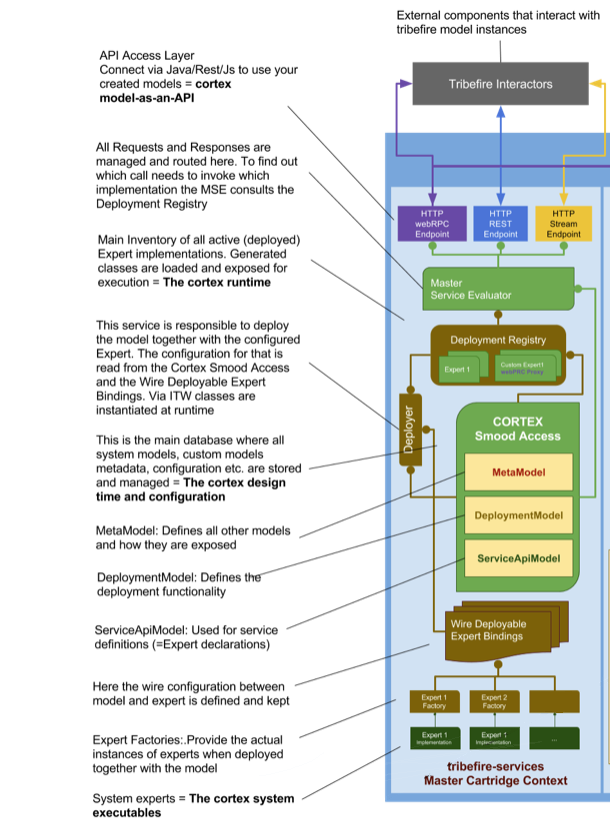

# Tribefire Services

## General
The architecture of tribefire is based on a modular structure with each component deployed to a JEE container via a servlet-based cartridges. tribefire Services are considered what we call the **Master Cartridge** and it is where the core services are hosted.

Different components are installed as web apps deployed to the JEE container, including clients like <a href="#" data-toggle="tooltip" data-original-title="{{site.data.glossary.control_center}}">Control Center</a> and <a href="#" data-toggle="tooltip" data-original-title="{{site.data.glossary.explorer}}">Explorer</a>, or tribefire extensions using <a href="#" data-toggle="tooltip" data-original-title="{{site.data.glossary.cartridge}}">cartridges</a>. Additionally, the core functionality and configuration is held in the so-called Master Cartridge, also called tribefire Services.

Communication between these components is done via webRPC. And contained in tribefire Services are the WebRPC endpoints, the components that interact with external requests and the core tribefire Services' functionality. This is the Java-based GM Core which contains several <a href="#" data-toggle="tooltip" data-original-title="{{site.data.glossary.smood}}">SMOOD</a> instances for the persistence of tribefire configuration information.

<a href="#" data-toggle="tooltip" data-original-title="{{site.data.glossary.cartridge}}">Cartridges</a> also communicate with tribefire Services, which is fundamentally also a cartridge, via webRPC. The specific deployment configuration is handled by tribefire Services, such as the synchronizing of the cartridge <a href="#" data-toggle="tooltip" data-original-title="{{site.data.glossary.model}}">models</a>, which loads the models from the cartridge into the tribefire Services database.

## Communication
External components communicate with tribefire through our API access layers:
* Java API,
* REST API
* tribefire.js

> For more information on REST API, see [Quick Start with REST](quick_start_rest.html).



Such requests, and their corresponding responses, are routed via the Master Service Evaluator which determines the call that should be made using the Deployment Registry.

## Authentication

Authentication in tribefire works based on either:
* a specially designed access
* an authentication service

By default, tribefire uses the `auth` access which is specially designed to work with users and passwords in a SMOOD context and the authentication request is done via a <a href="#" data-toggle="tooltip" data-original-title="{{site.data.glossary.ddsa}}">DDSA</a> request. 

The default authentication method is configured in the `CortexConfiguration` entity. Even though you can create your own access for authentication purposes, it is easier to use an authentication service. 

You can use the the following authentication services with tribefire:

* [LDAP](ldap_creating_connection.html)
* [SHIRO](shiro.html)
