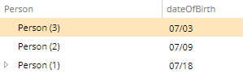

# Date Clipping

You can use this metadata to influence how date and time are displayed.

Metadata Property Name  | Type Signature  
------- | -----------
`DateClipping` | `com.braintribe.model.meta.data.constraint.DateClipping`

## General

Using the Date Clipping metadata, you can configure what date clipping is available without changing the representation of the data in memory. You can use this metadata to influence how the date is represented in the UI and impact the behavior of algorithms which use the date. There are two parameters used by this metadata:

Parameter | Available Values | Description
------| --------- | -------
`lower` | milisecond, second, minute, hour, day, month, year | Describes the lower boundary and the increment amount until the upper boundary is reached.
`upper` | milisecond, second, minute, hour, day, month, year | Describes the upper boundary.

## Example

Currently, several upper and lower boundary configurations are supported:

Lower Boundary | Upper Boundary
------| ---------
month | null, year
day | null, year, month
year | null, year
second | null, year
null, milisecond | null, year

>If no valid combination is found, the default pattern is used - MM/dd/yyyy HH:mm for the English language.

To put things in perspective, let's assume that the lower boundary is a `day` and the upper boundary is a `month`. This means that the available values are all the days in a month. For example, setting the Date Clipping metadata for the `dateOfBirth` property of the `Person` entity, results in the following being displayed:

