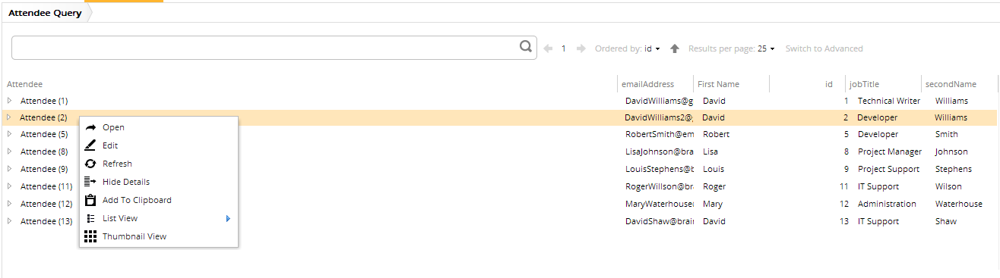

# Deletable

These metadata properties allow you to configure whether you can delete instances of the entity type they are assigned to.

Metadata Property Name  | Type Signature  
------- | -----------
`Deletable` | `com.braintribe.model.meta.data.constraint.Deletable`
`NonDeletable` | `com.braintribe.model.meta.data.constraint.NonDeletable`

## General

If the Deletable (or no) metadata is configured, then this property can be deleted using REST API or Explorer. If the NonDeletable metadata is assigned, then an element cannot be deleted.

You can attach this metadata to:

* models
* properties
* entity types
* enum types
* enum constants

> For more information see [Predicate Metadata](predicate.md).

## Example

In this example the NonDeletable metadata is added to the `Attendee` entity with the `id` of `2`. This results in not being able to delete that particular instance:

