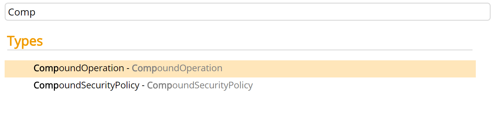
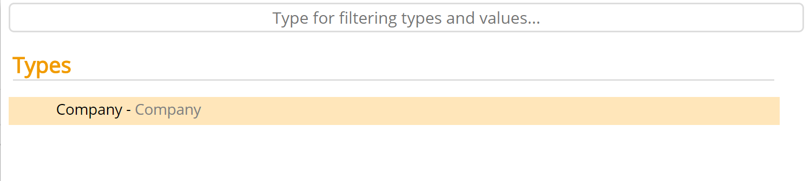

# Instantiable

These metadata properties allow you to configure the instantiation permissions of the entity type they are assigned to.

Metadata Property Name  | Type Signature  
------- | -----------
`Instantiable` | `com.braintribe.model.meta.data.constraint.Instantiable`
`NonInstantiable` | `com.braintribe.model.meta.data.constraint.NonInstantiable`

## General

If you assign the Instantiable metadata to an entity, you can instantiate this entity.
> The instantiation of entities refers to the ability to create new instances by using the **New** button located at the bottom of the properties panel in tribefire Control Center/Explorer.

The NonInstantiable metadata, does the opposite. If you assign the NonInstantiable metadata to an entity, you are not able to create an instance of that entity type. However, you are still able to create new instances using the selection constellation panel.

## Example

If you assign the NonInstantiable metadata to an entity, you are not able to create new instances using the REST API or by clicking the **Create new instance** button:

If the Instantiable metadata is added or the metadata field is empty, you are able to create new instances of an entity by using the create new instance button:

