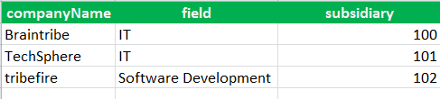
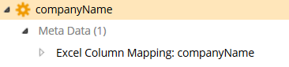

# Excel Column Mapping

You can import data from an Excel spreadsheet by defining columns in a worksheet that are related to properties in Tribefire.

Metadata Property Name  | Type Signature  
------- | -----------
`ExcelColumnMapping` | `com.braintribe.model.ieaction.excel.ExcelColumnMapping`

## General

Using the ExcelColumnMapping metadata, you associate the properties with the columns in Microsoft Excel by defining metadata on each property data should be imported to. There are two types of metadata that are used to map properties and columns:

* ExcelColumnMapping
* ExcelReferenceColumnMapping

>For more information on the Excel Reference Column Mapping metadata, see [Excel Reference Column Mapping](excel_reference.md).

The ExcelColumnMapping metadata is used to map simple types. To configure this metadata you define the `columnName` property with the name of the corresponding column in Excel.

## Example

You only have to configure the columnName property. The value given must correspond to the name of the column in your Excel spreadsheet.

In the screenshot above, there are three columns. They correspond to the properties found in a `Company` entity.

For the property `companyName` (which belongs to the `Company` entity), you set the ExcelColumnMapping metadata and insert the value `companyName` (the name defined in the Excel spreadsheet).
