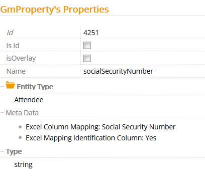

# Excel Identity Management Property

The Excel Identity Management Property metadata allows you to identity a unique element in each entity that data is imported to.

Metadata Property Name  | Type Signature  
------- | -----------
`ExcelIdentityManagementProperty` | `com.braintribe.model.ieaction.excel.ExcelIdentityManagementProperty`

## General

Using the Excel Identity Management Property, you can import data from an Excel spreadsheet by defining columns in a worksheet that are related to properties in tribefire. This functions similarly to a key in a database or the Unique and NonUnique metadata. When configured, the property to which this metadata has been attached cannot hold duplicate values.

If a property is of a complex type (that is, the type is itself an entity type) then the entity which it represents must have a Excel Identity Management Property defined. This is so that Tribefire can use it to identify the correct instance of the element it represents.

There are only two accepted values for this metadata property, either `true` or `false`. This choice is presented by a checkbox, which when checked means that the property is unique. If the checkbox is not checked, the property is not unique.

For example, if you have a entity with a property called `company`, which is a complex type representing an entity `Company`, you must configure this metadata on the `Company` entity. This allows tribefire to either assign the correct `Company` instance to the property or, if there is no existing instance representing the company defined, to create a new one and attach it to the `company` property.
> If you import data and there are two duplicate values that represent the property attached with this metadata, the last of these values is used. The other two are not stored.

## Example

### Configuration

The metadata only has one property which requires configuration: `identificationProperty`. If you check this box, it sets the value to `true`, and means that this property only imports unique values. However, if you uncheck this option, the metadata functionality is turned off and tribefire is able to import duplicate values.

### Unique Values

The Excel Identity Management Property metadata function similar to a unique key in a database. When this metadata is assigned to a property, it cannot hold duplicate values.

In the example below, the entity `Attendee` has a property `socialSecurityNumber` which has been given this metadata.

The data that is imported has two social security numbers which are the same.

In this scenario, only the last value is imported.

### Reference for Complex Types

In addition to this metadata functioning like a unique key, it is also used in conjunction with the metadata Excel Reference Column Mapping to import data related to complex types.
> For more information on the Excel Reference Column Mapping metadata, see [Excel Reference Column Mapping](excel_reference.md).

If there is a property in your entity type which is complex, then you require an Excel Identity Mangement Property metadata configured on the entity type the property represents. This allows tribefire to identify and match the data to an instance of this type and define that property. If an instance doesn't exist then a new one is created for the property.

In the example below, the entity type `Attendee` has the property `company`. This property is complex type entity and represents the `Company` entity type. Therefore, you must attach an instance of the Excel Identity Management Property metadata to a unique value in the entity type `Company`. In this case, the `companyName` property is assigned the metadata.

A column `company` has been defined in the worksheet that will be imported. There is a second `Company` worksheet that contains three unique company names.

Using this metadata and the Excel Reference Column Mapping metadata, this data is linked when imported.
> Without this metadata, you receive an error message on the console when attempting an import. This does not stop tribefire from importing other data, but this property remains `null`.
