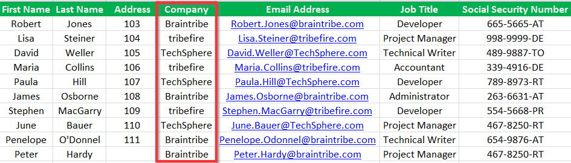

# Excel Reference Column Mapping

You can import data from an Excel spreadsheet by defining columns in a worksheet that are related to properties in tribefire.

Metadata Property Name  | Type Signature  
------- | -----------
`ExcelReferenceColumnMapping` | `com.braintribe.model.ieaction.excel.ExcelReferenceColumnMapping`

## General

Using the Excel Reference Column Mapping metadata, you associate the properties with the columns in Excel by defining metadata on each property that should data should be imported to. There are two types of metadata that are used to map properties and columns: Excel Column Mapping and Excel Reference Column Mapping.

> For more information on the Excel Column Mapping and Excel Reference Column Mapping metadata, see [Excel Column Mapping](excel_column.md) and [Excel Reference Column Mapping](excel_reference.md).

The Excel Reference Column Mapping metadata is used to map complex types.

To configure this property, you enter the name of the corresponding column in Excel and also select the unique property belonging to the entity type it relates to. That is, if the property is of a complex type, it relates to another entity type. This related entity type must have a unique value, as defined by the Excel Identity Management Property metadata, which you must also define.
Icon

The Excel Reference Column Mapping metadata is attached to the property that the data is imported to, whereas the Excel Identity Management Property metadata is attached to a unique property of the entity that it is related to.

For example, an entity called `Attendee` has a property called `company`. This is of a complex type and refers to another entity called `Company`. When configuring `company` (the property belonging to Attendee) you enter the corresponding column name defined in Excel and also select a property belonging to the `Company` entity which is unique, in this example `companyName`.

## Example

This metadata is used in conjunction with the Excel Identity Management Property metadata to import data related to complex types. There are two properties which you must configure:

* `columnName`
* `referenceProperty`

The value of `columnName` must correspond to the Excel column the data is received from. The value of `referenceProperty` must correspond to the property of the related entity type which you want to populate.

In this example, there is an entity called `Attendee`. It has a property called `company` and describes which company each instance of an `Attendee` works for. It is a complex type and refers to another entity called `Company`.

The data configured in the Excel spreadsheet refers to the company name and is defined by the column named `Company`.

Therefore, we configure this metadata with its two properties. The value of the `columnName` property is set to `Company` because that is what the column in Excel is called and the value of the `referenceProperty` property is set to `companyName` because this is the property in the entity `Company` which matches this data.

This property is also defined as the unique identifier, by configuring the Excel Identity Management Property here.
> For more information on the Excel Identity Management Property metadata, see [Excel Identity Management Property](excel_identity.md).

When you currently configure both metadata, the data is imported and an correct instance of Company is defined for the Attendee.
> Without this property, the Excel Reference Column Mapping metadata does not function and no data is imported.

