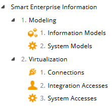

# Bulleting

This metadata property allows you to configure whether properties of a list type are displayed in a numbered list.

Metadata Property Name  | Type Signature  
------- | -----------
`Bulleting` | `com.braintribe.model.meta.data.display.Bulleting`

## General

If this metadata is configured and the value set to `true`, then the values of the properties in a list are displayed with numbers next to each item. There are only two accepted values for this metadata property, either `true` or `false`.

## Example

If you assign the Bulleting metadata, then each element of the properties list is displayed with a number next to it. In this example, the `subfolder` property of the entity type `Folder` has been attached with this metadata:

