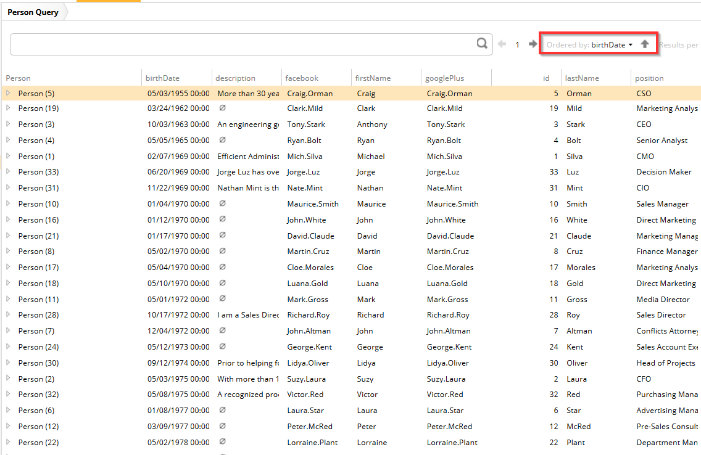

# DefaultSort

You can use this metadata to configure which column is sorted by default.

Metadata Property Name  | Type Signature  
------- | -----------
`DefaultSort` | `com.braintribe.model.meta.data.display.DefaultSort`

## General

Without this metadata, the column that is sorted by default is the `ID` column. However, you can configure Default Sort so that a different column is sorted. To configure this metadata you must choose which property you wish to use and whether the sorting order should be:

* ascending
* descending

## Example

In the example below, the property being used is `birthDate` and the direction ascending (that is, from youngest to oldest). When displayed in Explorer, the Ordered by option is set to the default sort value, and that the results have been sorted from oldest date to newest.

