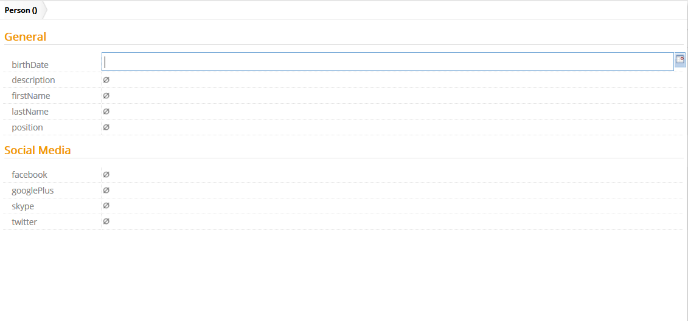
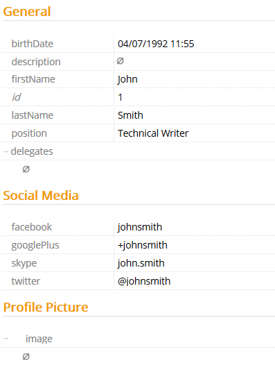

# GroupAssignment

This metadata allows you to assign different properties to a group.

Metadata Property Name  | Type Signature  
------- | -----------
`GroupAssignment` | `com.braintribe.model.meta.data.display.GroupAssignment`

## General

When you create a new instance of an entity, properties are displayed in the groups you defined with this metadata. The same groups are also used in the property panel.

To configure this metadata, you first must create groups that you wish to use. These groups are not fixed to any property and therefore can be reused in different use cases. For example, a default group called `General` can be used in several different entities. Once you have created your groups then you can use this metadata to assign your properties to it. You must attach this metadata to every property in a specific entity that you wish to be grouped.
> The groups, when displayed, are not ordered. If you wish to order these groups, you must use the Group Priority metadata. This metadata is configured at the entity level. That is, you assign this metadata to the entity in which the properties have been grouped.

## Example

Once you have created the groups, you can use this metadata to assign a property to this group.

In this example, there are three groups used: `General`, `Social Media` and `Profile Picture`. All properties in the entity `Person` are assigned to one of these three groups.
After assigning all the properties into their logical groups, they are displayed in Expert Mode under these different groups.

Either when creating a new instance of the entity:

