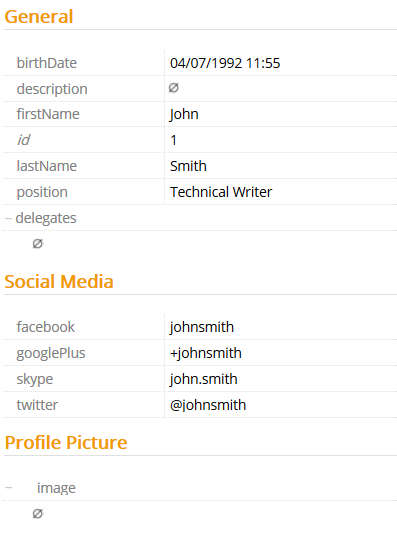

# GroupPriority

This metadata allows you to order any groups that are displayed in an instance of the entity it is assigned to.

Metadata Property Name  | Type Signature  
------- | -----------
`GroupPriority` | `com.braintribe.model.meta.data.display.GroupPriority`

## General

The first step when using this metadata is to assign the entity's properties into different groups, using the Group Assignment metadata. This then displays all properties in their logical groups. You can then use this metadata to assign a different priority to each group, therefore ordering each according to the assigned value. The value should be a decimal number between `0` and `1`, where `1` is displayed a group at the top of a list and `0` at the bottom. The different groups are ordered according to this value, highest to lowest.

To use this metadata correctly, each group used within an entity should be assigned a Group Priority metadata. For example, if an entity's properties were to be assigned between three groups, you would have to assign a Group Priority metadata to each of these three groups.

## Example

After assigning the entity's properties into different groups, you must then configure a Group Priority for each of these groups.

In the example below, there are three different groups used in the entity `Person`: `General`, `Social Media` and `Profile Picture`. Each group is then assigned a different value. The table below shows that `General` should be ordered first, as it has the highest priority value, then `Social Media`, and `Profile Picture`.

Group | Priority
----- | -------
General | 1
Social Media | 0.5
Profile Picture | 0.4

This ordering is then reflected in Control Center or Explorer.

