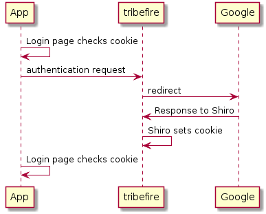

## Shiro Cartridge

Using the Shiro cartridge allows you to use a third-party authentication service like Google and integrate it into tribefire. This enables you to use a third-party account to successfully create and maintain a tribefire session. The cartridge uses the Apache Shiro technology to provide said functionality.

> For more information, see [https://shiro.apache.org/](https://shiro.apache.org/).

Even though the Google usecase is the third-party authentication service we focus on, the Shiro cartridge provides the possibility of integrating the following authentication services:
* facebook
* GitHub
* Twitter
* Google

<!--For information about integrating tribefire with Google authentication using the Shiro cartridge, see [Shiro cartridge tutorials](general.html)-->

## Google Authentication Flow

If your custom application is on same server as your tribefire instance, then you can redirect users to `http://localhost:8080/tribefire-services/component/remote-login/auth/google?continue=http://localhost:8080/app`.

After logging in, a `tfsessionId` cookie is set, and user is redirected to the URL specified in the `continue` query parameter.

Then, your application checks the `tfsessionId` cookie and use it as session ID.

<!-- 
https://www.planttext.com/

@startuml

App -> App: Login page checks cookie

App -> tribefire: authentication request

tribefire -> Google: redirect

Google -> tribefire: Response to Shiro

tribefire -> tribefire: Shiro sets cookie

App -> App: Login page checks cookie
@enduml 

If your application is on same server as the tribefire instance you're using, the app will not be able to read the cookie from the tribefire server. In that case, you should create a web terminal in tribefire to provide the session ID . Example: https://bitbucket.braintribe.com/projects/BP/repos/braincellplatform/browse/braincellplatform-setup-deployable-webterminal/src/main/java/com/tribefire/braincellplatform/setup/deployable/webterminal/BraincellPlatformGetSessionWebTerminal.java

-->