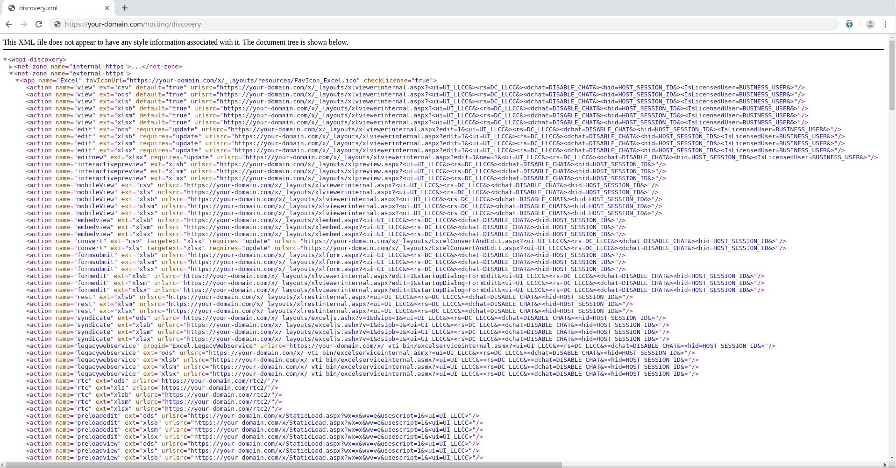

# Microsoft Office Web Apps Server - Installation and Configuration

## Introduction
ADX is a DMS used for accessing files from external repositories in one place (Documentum, Sharepoint etc.). ADx supports a feature called *online edit* which allows users to edit Microsoft Office files directly within a web browser. This is accomplished by utilizing [WOPI (Web Application Open Platform Interface Protocol)](https://docs.microsoft.com/en-us/openspecs/office_protocols/ms-wopi/6a8bb410-68ad-47e4-9dc3-6cf29c6b046b). In order to utilize ADx Online Edit functionalities, user has to deploy an external server called Microsoft Office Online Server. This page contains information and steps needed to install and configure Microsoft Office Online Server.

### Microsoft Office Web Apps Server Versions

|  Build   |Availability Date|  Support End Date |
|:--------:|:---------------:|:-----------------:|
| 16.0.6814.2226 | 04-05-2016 | 18-11-2016 |
| 16.0.7601.6800 | 18-11-2016 | 18-05-2017 |
| 16.0.7766.8550 | 18-05-2017 | 08-11-2017 |
| 16.0.8471.8525 | 08-11-2017 | 30-11-2018 |
| 16.0.10338.20039 | 30-11-2018 | TBD |

### Hardware requirements

Office Web Apps Server uses the same minimum hardware requirements as SharePoint Server 2013 which is Ram 8GB, CPU 64-bit, 4 CPU cores, DISC 80 GB for system drive.

### Software requirements

* The 64-bit edition of Windows Server 2008 R2 Service Pack 1 (SP1) Standard, Enterprise, or Datacenter with the Update for Windows Server 2008 R2 x64 Edition installed.
* The 64-bit edition of Windows Server 2012 Standard or Datacenter.
* The 64-bit edition of Windows Server 2012 R2. To use this operating system, you must use Office Web Apps Server Service Pack 1 (SP1).


### Important

 * All servers in the Office Web Apps Server farm must be part of a domain. They can be in the same domain (recommended) or in domains that are in the same forest. However, Office Web Apps Server won’t work if you try to install it on a domain controller!
 * It is strongly recommended to install Office Online Server on an empty Windows server which isn't running anything except OOS.

Make sure that you do NOT do the following when deploying Office Web Apps Server:

* Don’t install any other server applications on the server that’s running Office Web Apps Server. This includes Exchange Server, SharePoint Server, Lync Server, and SQL Server. If you have a shortage of servers, consider running Office Web Apps Server in a virtual machine instance on one of the servers you have.

* Don’t install any services or roles that depend on the Web Server (IIS) role on port 80, 443, or 809 because Office Web Apps Server periodically removes web applications on these ports.

* Don’t install any version of Office. If it’s already installed, you’ll need to uninstall it before you install Office Web Apps Server.

* Don’t install Office Web Apps Server on a domain controller. It won’t run on a server with Active Directory Domain Services (AD DS).

### Firewall ports
* Port 443 for HTTPS traffic
* Port 80 for HTTP traffic
* Port 809 for private traffic between the servers that run Office Web Apps Server (if you’re setting up a multi-server farm)

### Installation

This document follows official Microsoft's guide for [deploying Office Web Apps Server](https://docs.microsoft.com/en-us/webappsserver/deploy-office-web-apps-server "Official Microsoft guide").

First, you need to prepare servers to run Office Web Apps Server:

1. [Install prerequisite software for Office Web Apps Server](#Install-prerequisite-software-for-Office-Web-Apps-Server)
2. [Install Office Web Apps Server and related updates](#Install-Office-Web-Apps-Server)

#### Install prerequisite software for Office Web Apps Server
Windows Server 2008 R2, Windows Server 2012, and Windows Server 2012 R2 have slightly different prerequisites, so select the appropriate procedure below to install the correct ones for your operating system.

**On Windows Server 2008 R2**

1. Install the following software:

    * [Windows Server 2008 R2 Service Pack 1](https://www.microsoft.com/en-us/download/details.aspx?id=5842)
    * [.NET Framework 4.5](https://www.microsoft.com/en-us/download/details.aspx?id=30653)
    * [Windows PowerShell 3.0](https://www.microsoft.com/en-us/download/details.aspx?id=34595)
    * [Platform update for Windows 7 SP1 and Windows Server 2008 R2 SP1 (KB2670838)](https://support.microsoft.com/en-us/help/2670838/platform-update-for-windows-7-sp1-and-windows-server-2008-r2-sp1)

2. Open the Windows PowerShell prompt as an administrator and run the following commands to install the required roles and services:

```powershell 
 Import-Module ServerManager
```

Then, run following command which will Install Microsoft IIS server and .Net-Framework with necessary modules:

```powershell 
 Add-WindowsFeature Web-Server,Web-WebServer,Web-Common-Http,Web-Static-Content,Web-App-Dev,Web-Asp-Net,Web-Net-Ext,Web-ISAPI-Ext,Web-ISAPI-Filter,Web-Includes,Web-Security,Web-Windows-Auth,Web-Filtering,Web-Stat-Compression,Web-Dyn-Compression,Web-Mgmt-Console,Ink-Handwriting,IH-Ink-Support,NET-Framework,NET-Framework-Core,NET-HTTP-Activation,NET-Non-HTTP-Activ,NET-Win-CFAC
```
If prompted, restart the server.

**On Windows Server 2012**

1. Open the Windows PowerShell prompt as an administrator and run following command to Install Microsoft IIS server and .Net-Framework, Asp.Net with necessary modules:

```powershell 
Add-WindowsFeature Web-Server,Web-Mgmt-Tools,Web-Mgmt-Console,Web-WebServer,Web-Common-Http,Web-Default-Doc,Web-Static-Content,Web-Performance,Web-Stat-Compression,Web-Dyn-Compression,Web-Security,Web-Filtering,Web-Windows-Auth,Web-App-Dev,Web-Net-Ext45,Web-Asp-Net45,Web-ISAPI-Ext,Web-ISAPI-Filter,Web-Includes,InkandHandwritingServices,NET-Framework-Features,NET-Framework-Core,NET-HTTP-Activation,NET-Non-HTTP-Activ,NET-WCF-HTTP-Activation45
```

If prompted, restart the server.

**On Windows Server 2012 R2**

1. Install the following software:
    * [.NET Framework 4.5](https://www.microsoft.com/en-us/download/details.aspx?id=42643)

2. Open the Windows PowerShell prompt as an administrator and run following command to Install Microsoft IIS server and Asp.Net with necessary modules:

```powershell 
Add-WindowsFeature Web-Server,Web-Mgmt-Tools,Web-Mgmt-Console,Web-WebServer,Web-Common-Http,Web-Default-Doc,Web-Static-Content,Web-Performance,Web-Stat-Compression,Web-Dyn-Compression,Web-Security,Web-Filtering,Web-Windows-Auth,Web-App-Dev,Web-Net-Ext45,Web-Asp-Net45,Web-ISAPI-Ext,Web-ISAPI-Filter,Web-Includes,InkandHandwritingServices,NET-Framework-Features,NET-Framework-Core,NET-HTTP-Activation,NET-Non-HTTP-Activ,NET-WCF-HTTP-Activation45
```
If prompted, restart the server.

#### Install Office Web Apps Server
Complete these steps on any servers that will run Office Web Apps Server:

1. Download Office Web Apps Server from the [Volume Licensing Service Center (VLSC)](https://www.microsoft.com/Licensing/servicecenter/default.aspx). To download Office Web Apps Server you must have a license, under a Volume Licensing agreement, for Office Professional Plus 2013, Office Standard 2013, or Office for Mac 2011. The download is located under those Office products on the VLSC portal. 

2. Install Office Online by running file setup.exe:


3. Additionally download and install service pack: [Office Web Apps Server SP1](https://support.microsoft.com/en-us/help/2880558/description-of-microsoft-office-web-apps-server-service-pack-1-sp1).

4. Start Office Online Server service in windows services


5. Join windows to domain (mandatory step):

    

6. Configure EXTERNAL DNS for your windows server machine, for example:
    * http://your-domain.com
    * https://your-domain.com

----------

### Deploy the Office Web Apps Server Farm
Follow the procedures in one of the following three sections, based on what kind of Office Web Apps Server farm you want to create:

1. [Deploy a Single-server Office Web Apps Server Farm that uses HTTP](#Deploy-a-Single-server-Office-Web-Apps-Server-Farm-that-uses-HTTP)
2. [Deploy a Single-server Office Web Apps Server Farm that uses HTTPS](#Deploy-a-Single-server-Office-Web-Apps-Server-Farm-that-uses-HTTPS)

If Windows PowerShell doesn’t recognize the New-OfficeWebAppsFarm cmdlet when you run it, you may need to import the OfficeWebApps module:

```powershell 
Import-Module -Name OfficeWebApps
```

### Deploy a Single-server Office Web Apps Server Farm that uses HTTP

1. Login with domain credentials **(important!)**

2. Run following powershell command to create Office Web Apps farm:

    ```powershell
    New-OfficeWebAppsFarm -InternalURL "http://your-domain.com" -AllowHttp -EditingEnabled
    ```
    For any prompt just confirm the default answer as in the image below:

    

3. Verify that the Office Web Apps Server farm was created successfully by running following powershell command:

    ```powershell
    Get-OfficeWebAppsFarm
    ```

    

4. Verify that the Office Web Apps Server farm was created successfully by opening the following page in web browser: [http://your-domain.com/hosting/discovery](http://your-domain.com/hosting/discovery)

    If everything is good, you should see similar output to one presented in the image below:
    

    If your changes are not reflected, restart OOS and IIS (World Wide Web Publishing Service) services.


### Deploy a Single-server Office Web Apps Server Farm that uses HTTPS

Before installing OOS Sever that usses HTTPS make sure that you've configured valid SSL certificates for IIS on Office Online Server, to do so use [this](https://helpdesk.ssls.com/hc/en-us/articles/115000853911-How-to-install-an-SSL-certificate-on-IIS-10) guide.

1. **Login with domain credentials(important)**

2. Run the following powershell command to create Office Web Apps farm:

    ```powershell
    New-OfficeWebAppsFarm -InternalURL "https://your-domain.com" -ExternalURL "https://your-domain.com" -AllowHttp -EditingEnabled
    ```
    For any prompt just confirm the default answer.

3. Verify that the Office Web Apps Server farm was created successfully by running the following powershell command:

    ```powershell
    Get-OfficeWebAppsFarm
    ```

    

4. Verify that the Office Web Apps Server farm was created successfully by openning following page in web browser: [http://your-domain.com/hosting/discovery](http://your-domain.com/hosting/discovery)

    If everything is good you should see similar output to one provided in image below:
    

    In case that changes are not reflected restart _Office Online_ and _World Wide Web Publishing_ services.

----------

### Additional options
New office web apps farm directive accepts some aditional options:

 - CacheLocation - Specifies global disk cache that is used to store rendered image files. The default value is `%programdata%\Microsoft\OfficeWebApps\Working\d`.
 - CacheSizeInGB - Specifies the maximum size of the global disk cache in gigabytes.

Full list of available options can be found in [official Microsoft Documentation](https://docs.microsoft.com/en-us/powershell/module/officewebapps/new-officewebappsfarm?view=officewebapps-ps).

## Installation - Quick guide for development TODO: rework

For development WOPI can also be installed on a domain controller!

1)
```bash
Add-WindowsFeature Web-Server,Web-Mgmt-Tools,Web-Mgmt-Console,Web-WebServer,Web-Common-Http,Web-Default-Doc,Web-Static-Content,Web-Performance,Web-Stat-Compression,Web-Dyn-Compression,Web-Security,Web-Filtering,Web-Windows-Auth,Web-App-Dev,Web-Net-Ext45,Web-Asp-Net45,Web-ISAPI-Ext,Web-ISAPI-Filter,Web-Includes,NET-Framework-Features,NET-Framework-45-Features,NET-Framework-Core,NET-Framework-45-Core,NET-HTTP-Activation,NET-Non-HTTP-Activ,NET-WCF-HTTP-Activation45,Windows-Identity-Foundation,Server-Media-Foundation
```

2)
use `en_office_online_server_last_updated_november_2017_x64_dvd_100181876.iso` -> run setup.exe

3)
Install language packs

4)
`Import-Module -Name OfficeWebApps`

`New-OfficeWebAppsFarm -InternalURL "http://servername" -AllowHttp -EditingEnabled`

5) 
check via `http://servername/hosting/discovery`